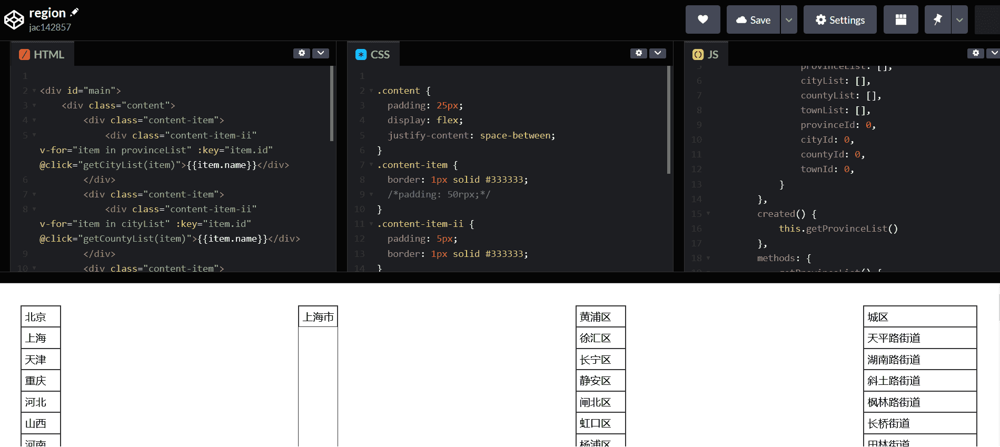

# 说明

> 地区数据（包含街道数据），暂时不包含港澳台


# java 查询逻辑

## mybatis
```xml

<select id="listAllByParams" resultType="com.lmxdawn.other.entity.Region">
    SELECT id,`name`,is_leaf
    FROM `region`
    <where>
        <if test="provinceId != null">
            `province_id` = #{provinceId}
            <if test="cityId != null">
                AND `city_id` = #{cityId}
                <if test="countyId != null">
                    AND `county_id` = #{countyId}
                </if>
            </if>
        </if>
    </where>
</select>

```

# 示例（需替换请求接口）

> 在线示例 ：https://codepen.io/jac142857/pen/GREPWvO
 
>  代码 `region.html`

# 效果



# Git 设置

`git config --local user.name ""`

`git config --local user.email ""`
